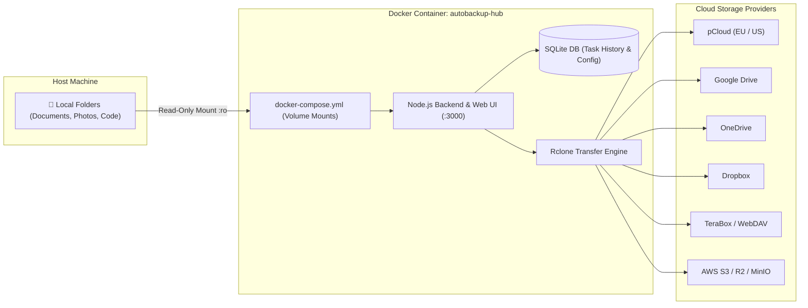

# AutoBackup Hub 🚀

[](LICENSE)
[](docker-compose.yml)
[](https://github.com/attacker2007/autobackup/pkgs/container/autobackup)
[](https://rclone.org)
[](https://nodejs.org)

**AutoBackup Hub** is a self-hosted, containerized multi-cloud backup and file synchronization manager with an interactive web dashboard. Powered by the high-performance **Rclone** engine, it allows you to automatically route, schedule, sync, and transfer files from your local machines (Windows, macOS, Linux) to cloud storage providers including **pCloud, Google Drive, Microsoft OneDrive, Dropbox, TeraBox, Box, Mega, and Amazon S3 / S3-compatible storage**.

---

## ⚡ Quick Run (Pre-built Image)

You can launch AutoBackup Hub directly using the pre-built Docker image from GitHub Container Registry:

```bash
docker run -d \
  --name autobackup-hub \
  --restart unless-stopped \
  -p 3000:3000 \
  -v ./config:/config \
  -v "C:/Users/yourname/Documents:/Documents:ro" \
  ghcr.io/attacker2007/autobackup:latest
```

---

## 📑 Table of Contents

- [🌟 Features](#-features)
- [🏗️ Architecture Overview](#️-architecture-overview)
- [🚀 Quick Start Guide](#-quick-start-guide)
  - [1. Clone Repository & Prepare Configuration](#1-clone-repository--prepare-configuration)
  - [2. Configure `docker-compose.yml`](#2-configure-docker-composeyml)
  - [3. Launch the Container](#3-launch-the-container)
- [☁️ Cloud Remote Setup Guides](#️-cloud-remote-setup-guides)
  - [⭐ In-Depth: pCloud Setup (EU & US Data Centers)](#-in-depth-pcloud-setup-eu--us-data-centers)
  - [Google Drive](#google-drive)
  - [Microsoft OneDrive](#microsoft-onedrive)
  - [Dropbox](#dropbox)
  - [TeraBox / WebDAV](#terabox--webdav)
  - [Mega & Box.com](#mega--boxcom)
  - [Amazon S3 / Cloudflare R2 / MinIO](#amazon-s3--cloudflare-r2--minio)
- [📋 Creating & Configuring Backup Tasks](#-creating--configuring-backup-tasks)
  - [Transfer Modes: Copy vs Sync vs Move](#transfer-modes-copy-vs-sync-vs-move)
- [🛡️ Security & Privacy Recommendations](#️-security--privacy-recommendations)
- [🔧 Environment Variables](#-environment-variables)
- [❓ Troubleshooting & FAQ](#-troubleshooting--faq)
- [📄 License](#-license)

---

## 🌟 Features

- **Multi-Cloud Integration**: Native support for pCloud, Google Drive, Microsoft OneDrive, Dropbox, Mega, Box, TeraBox (via WebDAV), and S3/MinIO.
- **Flexible File Routing**: Map distinct local directory mounts (e.g. `/Documents`, `/Pictures`, `/Code`) to specific cloud destinations.
- **Automated Scheduling**: Cron-based interval engine (every 15 mins, hourly, daily, weekly, or custom cron syntax).
- **Multiple Transfer Modes**:
  - `Copy`: Upload new or modified files without modifying the destination or local files.
  - `Sync`: Ensure destination folder perfectly mirrors the local folder.
  - `Move`: Upload files and automatically remove local copies upon completion.
- **Interactive Cloud Explorer**: Browse, inspect, download, and delete files directly on remote clouds from the web UI.
- **Bandwidth & Performance Throttling**: Configure speed limits (e.g. `10M`, `50M`) and parallel transfer threads per backup task.
- **Real-Time Live Console**: Monitor file-by-file transfer progress, network speeds, and error logs in real-time over WebSockets.
- **PIN Lock Protection**: Secure dashboard access with a configurable security PIN.

---

## 🏗️ Architecture Overview



---

## 🚀 Quick Start Guide

### 1. Clone Repository & Prepare Configuration

```bash
git clone https://github.com/your-username/autobackup-hub.git
cd autobackup-hub
mkdir -p config
```

### 2. Configure `docker-compose.yml`

Copy the sample compose file or customize `docker-compose.yml` with your local folders:

```yaml
services:
  autobackup-hub:
    build: .
    container_name: autobackup-hub
    restart: unless-stopped
    ports:
      - "3000:3000"
    environment:
      - PORT=3000
      - CONFIG_DIR=/config
      - RCLONE_CONFIG=/config/rclone.conf
    volumes:
      # Persistent configuration & database
      - ./config:/config

      # ── Backup Source Folders (Mount read-only for safety) ─────────────────
      # Windows Example:
      - "C:/Users/yourname/Documents:/Documents:ro"
      - "C:/Users/yourname/Pictures:/Pictures:ro"
      - "D:/Projects:/Code/Projects:ro"
      
      # Linux / macOS Example:
      # - "/home/user/documents:/Documents:ro"
      # - "/home/user/pictures:/Pictures:ro"
```

> **Tip**: Always add `:ro` (read-only) to your source folder mounts to ensure safety when performing backups.

### 3. Launch the Container

```bash
docker compose up -d --build
```

Access the web dashboard in your browser:
👉 **`http://localhost:3000`**

---

## ☁️ Cloud Remote Setup Guides

---

### ⭐ In-Depth: pCloud Setup (EU & US Data Centers)

pCloud is supported via OAuth2. Because pCloud maintains two distinct data center infrastructures (**European Union** and **United States**), proper regional configuration is necessary to prevent authentication errors.

#### Step 1: Identify Your Account Region
1. Log into your account at [pCloud.com](https://my.pcloud.com/).
2. Look at your browser URL bar or Account Settings:
   - If your dashboard is at `my.pcloud.com`, your account is hosted in the **United States (US)**.
   - If your dashboard is at `eapi.pcloud.com` or redirects to the EU data center, your account is in the **European Union (EU)**.

#### Step 2: Generate Rclone OAuth Token
Open Command Prompt, PowerShell, or Terminal on your laptop where [Rclone](https://rclone.org/downloads/) is installed:

- **For European Union (EU) Accounts (Most EU users)**:
  ```bash
  rclone authorize "pcloud" "hostname" "eapi.pcloud.com"
  ```
- **For United States / Global Accounts**:
  ```bash
  rclone authorize "pcloud" "hostname" "api.pcloud.com"
  ```

#### Step 3: Complete Web Authorization
1. Running the command will automatically open your default browser to pCloud's authorization page.
2. Click **Allow** / **Accept** to grant Rclone access to your pCloud storage.
3. Return to your terminal. You will see a JSON token string:
   ```json
   {"access_token":"xXxXxXxXxXxXxXxXxXxXxXxXxXx","token_type":"bearer","expiry":"2026-08-28T00:00:00Z"}
   ```

#### Step 4: Add Remote in AutoBackup Hub
1. In the AutoBackup Hub web dashboard (`http://localhost:3000`), click **Manage Remotes** > **New Remote**.
2. Set **Remote Name** (e.g. `pcloud_backup`).
3. Set **Provider Type** to `pCloud`.
4. Select your **Account Region / Data Center**:
   - 🇪🇺 `European Union (EU) Server - eapi.pcloud.com`
   - 🇺🇸 `United States (US) Server - api.pcloud.com`
5. Paste the JSON token generated from Step 3 into the **Access Token** field.
6. Click **Add & Verify Remote**.

---

#### 🛠️ pCloud Troubleshooting & Error Guide

| Error Code / Symptom | Cause | Solution |
| :--- | :--- | :--- |
| **`Error 2094: Invalid access_token`** or **`Log in to EU server`** | Token was authorized for the US server (`api.pcloud.com`), but your pCloud account is registered in Europe (`eapi.pcloud.com`). | Run: `rclone authorize "pcloud" "hostname" "eapi.pcloud.com"`, and ensure the **EU Server** region option is selected in the dashboard. |
| **Port 53682 conflict on Windows** | Windows Hyper-V / WSL2 reserved port 53682. | Use the terminal command shown in the AutoBackup Hub UI or run `rclone authorize` on your host OS. |
| **Token Expired / Refresh Failed** | pCloud tokens require persistent `config/rclone.conf` mounting. | Ensure `./config:/config` is mounted in `docker-compose.yml` so refreshed tokens persist across container restarts. |

---

### Google Drive
1. In AutoBackup Hub, go to **Manage Remotes** > **New Remote** > Select **Google Drive**.
2. Generate an authorization token on your machine:
   ```bash
   rclone authorize "drive"
   ```
3. Grant access in the browser window, then copy and paste the returned JSON token into the dashboard.

### Microsoft OneDrive
1. Go to **Manage Remotes** > **New Remote** > Select **OneDrive**.
2. Run in terminal:
   ```bash
   rclone authorize "onedrive"
   ```
3. Authenticate with your Microsoft account, copy the JSON token, and save the remote in AutoBackup Hub.

### Dropbox
1. Select **Dropbox** under **Manage Remotes**.
2. Run in terminal:
   ```bash
   rclone authorize "dropbox"
   ```
3. Authorize the application and paste the token JSON.

### TeraBox / WebDAV
1. Select **TeraBox / WebDAV** as the provider type.
2. Enter your WebDAV server endpoint (e.g. `http://127.0.0.1:8080/webdav` or remote WebDAV URL).
3. Provide your Username / Email and Password / Token.
4. Click **Add & Verify Remote**.

### Mega & Box.com
- **Mega**: Select `Mega` and input your Mega account email and password.
- **Box**: Select `Box.com` and run `rclone authorize "box"`.

### Amazon S3 / Cloudflare R2 / MinIO
1. Select **Amazon S3 / S3-Compatible**.
2. Provide your **Access Key ID**, **Secret Access Key**, **Region** (e.g. `us-east-1` or `auto`), and custom **Endpoint URL** (for Cloudflare R2, MinIO, or Wasabi).

---

## 📋 Creating & Configuring Backup Tasks

1. Navigate to the **Dashboard** and click **New Backup Task**.
2. **Task Name**: Give your backup job a recognizable name (e.g. `Documents to pCloud`).
3. **Source Directory**: Select or enter the container path of your mounted directory (e.g. `/Documents`).
4. **Destination Remote & Path**: Select your configured cloud remote and specify the destination folder (e.g. `pcloud_backup:MyLaptop/Documents`).
5. **Schedule Interval**:
   - `Every 15 Minutes`
   - `Every Hour`
   - `Daily at 02:00`
   - `Custom Cron Expression` (e.g. `0 */4 * * *`)
6. **Transfer Mode**: Choose between **Copy**, **Sync**, or **Move**.
7. **Bandwidth Limits & Concurrency**: (Optional) Limit upload speed (e.g. `20M`) or concurrent transfer threads (`4`).

---

### Transfer Modes: Copy vs Sync vs Move

```
Local Source:  [ FileA, FileB, FileC ]
Cloud Remote:  [ FileA, FileOld ]

Mode [Copy]:
Result on Remote -> [ FileA (Updated), FileB (New), FileC (New), FileOld (Kept) ]
Result on Local  -> [ FileA, FileB, FileC ] (Untouched)

Mode [Sync]:
Result on Remote -> [ FileA (Updated), FileB (New), FileC (New) ]  <-- FileOld is deleted!
Result on Local  -> [ FileA, FileB, FileC ] (Untouched)

Mode [Move]:
Result on Remote -> [ FileA, FileB, FileC, FileOld ]
Result on Local  -> [ ] (Local files deleted after successful transfer)
```

> ⚠️ **Sync Warning**: `Sync` mode deletes files on the remote destination that no longer exist in the local source. For non-destructive backups, always use `Copy` mode.

---

## 🛡️ Security & Privacy Recommendations

- **Mount Read-Only (`:ro`)**: Protect your original laptop files from accidental deletion by appending `:ro` to volume mounts in `docker-compose.yml`.
- **Exclude Sensitive Files**: Keep your credentials and database safe. Never commit `./config/rclone.conf` or `./config/autobackup.db` to public Git repositories (already configured in `.gitignore`).
- **Dashboard PIN Protection**: Enable PIN protection in the web UI when hosting AutoBackup Hub on a shared local network.

---

## 🔧 Environment Variables

| Variable | Default | Description |
| :--- | :--- | :--- |
| `PORT` | `3000` | Port for the Web Dashboard & API service |
| `CONFIG_DIR` | `/config` | Directory where SQLite database and configs are stored |
| `RCLONE_CONFIG` | `/config/rclone.conf` | Path to Rclone configuration file |

---

## ❓ Troubleshooting & FAQ

#### Q: How do I verify my cloud remote connection?
In the web dashboard, open **Manage Remotes** and click the **Test Connection** button next to any configured remote.

#### Q: Can I run a backup immediately without waiting for the schedule?
Yes! Click the **▶ Run Now** button on any backup task card in the dashboard.

#### Q: Where are transfer logs stored?
Live logs stream in real-time on the dashboard under **Live Log Console**. Historical task run logs and execution metrics are saved in SQLite database under `./config/autobackup.db`.

---

## 📄 License

This project is licensed under the MIT License - see the [LICENSE](LICENSE) file for details.
