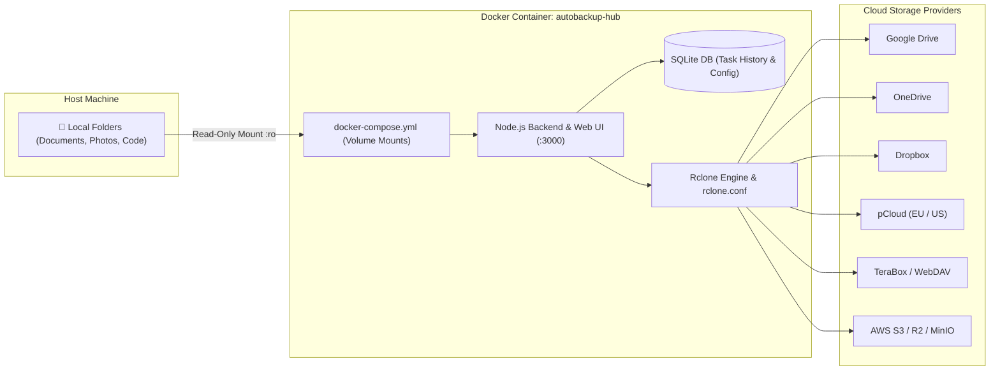

# AutoBackup Hub 🚀

[](LICENSE)
[](docker-compose.yml)
[](https://github.com/attacker2007/autobackup/pkgs/container/autobackup)
[](https://rclone.org)
[](https://nodejs.org)

**AutoBackup Hub** is a self-hosted, containerized multi-cloud backup and file synchronization manager with an interactive web dashboard. Powered by the high-performance **Rclone** engine, it allows you to automatically route, schedule, sync, and transfer files from your local machines (Windows, macOS, Linux) to cloud storage providers including **Google Drive, Microsoft OneDrive, Dropbox, pCloud, TeraBox, Box, Mega, and Amazon S3 / S3-compatible storage**.

---

## ⚡ Quick Run (Pre-built Image)

You can launch AutoBackup Hub directly using the pre-built Docker image from GitHub Container Registry:

```bash
docker run -d \
  --name autobackup-hub \
  --restart unless-stopped \
  -p 3000:3000 \
  -v ./config:/config \
  -v "C:/Users/yourname/Documents:/Documents:ro" \
  ghcr.io/attacker2007/autobackup:latest
```

---

## 📑 Table of Contents

- [🌟 Features](#-features)
- [🏗️ Architecture Overview](#️-architecture-overview)
- [🚀 Quick Start Guide](#-quick-start-guide)
  - [1. Clone Repository & Prepare Configuration](#1-clone-repository--prepare-configuration)
  - [2. Configure `docker-compose.yml`](#2-configure-docker-composeyml)
  - [3. Launch the Container](#3-launch-the-container)
- [🔧 In-Depth: Rclone Integration & Usage Guide](#-in-depth-rclone-integration--usage-guide)
  - [How AutoBackup Hub Uses Rclone](#how-autobackup-hub-uses-rclone)
  - [Installing Rclone CLI on Your Host Machine](#installing-rclone-cli-on-your-host-machine)
  - [OAuth Token Generation via `rclone authorize`](#oauth-token-generation-via-rclone-authorize)
  - [Importing an Existing `rclone.conf`](#importing-an-existing-rcloneconf)
  - [Transfer Flags & Performance Optimization](#transfer-flags--performance-optimization)
  - [Encrypted Backups via `rclone crypt`](#encrypted-backups-via-rclone-crypt)
  - [Rclone Troubleshooting & FAQ](#rclone-troubleshooting--faq)
- [☁️ Cloud Remote Setup Guides](#️-cloud-remote-setup-guides)
  - [pCloud (EU & US Data Centers)](#pcloud-eu--us-data-centers)
  - [Google Drive](#google-drive)
  - [Microsoft OneDrive](#microsoft-onedrive)
  - [Dropbox](#dropbox)
  - [TeraBox / WebDAV](#terabox--webdav)
  - [Mega & Box.com](#mega--boxcom)
  - [Amazon S3 / Cloudflare R2 / MinIO](#amazon-s3--cloudflare-r2--minio)
- [📋 Creating & Configuring Backup Tasks](#-creating--configuring-backup-tasks)
  - [Transfer Modes: Copy vs Sync vs Move](#transfer-modes-copy-vs-sync-vs-move)
- [🛡️ Security & Privacy Recommendations](#️-security--privacy-recommendations)
- [🔧 Environment Variables](#-environment-variables)
- [📄 License](#-license)

---

## 🌟 Features

- **Multi-Cloud Integration**: Native support for Google Drive, Microsoft OneDrive, Dropbox, pCloud, Mega, Box, TeraBox (via WebDAV), and S3/MinIO/Cloudflare R2.
- **Powered by Rclone**: High-performance multi-threaded chunked uploads, checksum validation, automatic retries, and rate limiting.
- **Flexible File Routing**: Map distinct local directory mounts (e.g. `/Documents`, `/Pictures`, `/Code`) to specific cloud destinations.
- **Automated Scheduling**: Cron-based interval engine (every 15 mins, hourly, daily, weekly, or custom cron syntax).
- **Multiple Transfer Modes**:
  - `Copy`: Upload new or modified files without modifying the destination or local files.
  - `Sync`: Ensure destination folder perfectly mirrors the local folder.
  - `Move`: Upload files and automatically remove local copies upon completion.
- **Interactive Cloud Explorer**: Browse, inspect, download, and delete files directly on remote clouds from the web UI.
- **Bandwidth & Performance Throttling**: Configure speed limits (e.g. `10M`, `50M`) and parallel transfer threads per backup task.
- **Real-Time Live Console**: Monitor file-by-file transfer progress, network speeds, and error logs in real-time over WebSockets.
- **PIN Lock Protection**: Secure dashboard access with a configurable security PIN.

---

## 🏗️ Architecture Overview



---

## 🚀 Quick Start Guide

### 1. Clone Repository & Prepare Configuration

```bash
git clone https://github.com/attacker2007/autobackup.git
cd autobackup
mkdir -p config
```

### 2. Configure `docker-compose.yml`

Copy the sample compose file or customize `docker-compose.yml` with your local folders:

```yaml
services:
  autobackup-hub:
    build: .
    container_name: autobackup-hub
    restart: unless-stopped
    ports:
      - "3000:3000"
    environment:
      - PORT=3000
      - CONFIG_DIR=/config
      - RCLONE_CONFIG=/config/rclone.conf
    volumes:
      # Persistent configuration & database
      - ./config:/config

      # ── Backup Source Folders (Mount read-only for safety) ─────────────────
      # Windows Example:
      - "C:/Users/yourname/Documents:/Documents:ro"
      - "C:/Users/yourname/Pictures:/Pictures:ro"
      - "D:/Projects:/Code/Projects:ro"
      
      # Linux / macOS Example:
      # - "/home/user/documents:/Documents:ro"
      # - "/home/user/pictures:/Pictures:ro"
```

> **Tip**: Always add `:ro` (read-only) to your source folder mounts to ensure safety when performing backups.

### 3. Launch the Container

```bash
docker compose up -d --build
```

Access the web dashboard in your browser:
👉 **`http://localhost:3000`**

---

## 🔧 In-Depth: Rclone Integration & Usage Guide

[Rclone](https://rclone.org) ("rsync for cloud storage") is the engine powering all data transfers, directory listings, quotas, and integrity checks in **AutoBackup Hub**.

### How AutoBackup Hub Uses Rclone

1. **Embedded CLI Execution**: The Docker container includes the official Rclone binary.
2. **Centralized Configuration**: All configured cloud remotes are stored in standard INI format inside `/config/rclone.conf` (persisted on your host under `./config/rclone.conf`).
3. **Live JSON Metric Streaming**: During backup tasks, the server parses Rclone's `--use-json-log` and `--stats` output, streaming real-time upload speed, remaining bytes, and file progress directly to the web dashboard via WebSockets.
4. **Non-Blocking Operations**: Rclone executes as child processes managed by an asynchronous task queue with concurrency controls.

---

### Installing Rclone CLI on Your Host Machine

While the container has Rclone built-in, installing Rclone on your host laptop is strongly recommended to quickly authorize browser-based OAuth2 tokens (Google Drive, OneDrive, Dropbox, pCloud, Box).

| Operating System | Command |
| :--- | :--- |
| **Windows (WinGet)** | `winget install Rclone.Rclone` |
| **Windows (Chocolatey)** | `choco install rclone` |
| **macOS (Homebrew)** | `brew install rclone` |
| **Linux (Ubuntu/Debian)** | `sudo apt update && sudo apt install rclone` |
| **Linux (Generic Script)** | `curl https://rclone.org/install.sh \| sudo bash` |

Verify installation with:
```bash
rclone version
```

---

### OAuth Token Generation via `rclone authorize`

Cloud storage providers require OAuth2 browser authentication. Because Docker containers run headlessly without a browser window, you run `rclone authorize` in your host terminal.

Run the appropriate command below on your laptop:

```bash
# Google Drive
rclone authorize "drive"

# Microsoft OneDrive
rclone authorize "onedrive"

# Dropbox
rclone authorize "dropbox"

# pCloud (European Union Data Center)
rclone authorize "pcloud" "hostname" "eapi.pcloud.com"

# pCloud (United States Data Center)
rclone authorize "pcloud" "hostname" "api.pcloud.com"

# Box.com
rclone authorize "box"
```

#### What Happens:
1. Your default web browser will open automatically.
2. Log in and grant permission to Rclone.
3. Return to your terminal. You will see a JSON token:
   ```json
   {"access_token":"ya29.a0AfH6SM...","token_type":"Bearer","refresh_token":"1//04...","expiry":"2026-08-28T02:00:00Z"}
   ```
4. Paste this entire JSON string into the **Access Token / Refresh Token** box in AutoBackup Hub when adding a remote.

---

### Importing an Existing `rclone.conf`

If you already use Rclone on your computer, you do not need to reconfigure your remotes!

1. Locate your existing `rclone.conf` on your machine:
   - **Windows**: `%APPDATA%\rclone\rclone.conf` (e.g. `C:\Users\<username>\AppData\Roaming\rclone\rclone.conf`)
   - **Linux / macOS**: `~/.config/rclone/rclone.conf`
2. Copy the file into your AutoBackup directory:
   ```bash
   cp ~/.config/rclone/rclone.conf ./config/rclone.conf
   ```
3. Or in the AutoBackup Hub UI, click **Manage Remotes** > **Import Raw Config** and paste the text.

---

### Transfer Flags & Performance Optimization

AutoBackup Hub dynamically applies optimal Rclone parameters per task:

| Feature | Rclone Parameter | Description |
| :--- | :--- | :--- |
| **Bandwidth Limit** | `--bwlimit 20M` | Prevents backup uploads from saturating your home/office internet. |
| **Parallel Transfers** | `--transfers 4` | Number of files transferred simultaneously. |
| **Parallel Checkers** | `--checkers 8` | Number of checksum/metadata comparison workers. |
| **Fast List** | `--fast-list` | Reduces API queries by fetching large directory listings in batch. |
| **Smart Conflict** | `--update --use-mtime` | Skips files that are newer on destination, only uploading changed data. |
| **Retries** | `--retries 3 --low-level-retries 10` | Automatic exponential backoff resilience on network hiccups. |

---

### Encrypted Backups via `rclone crypt`

For maximum privacy, you can configure an **encrypted remote** (`crypt`) layered on top of any cloud provider. Files and filenames are encrypted client-side with AES-256 before leaving your computer.

1. In host terminal, run:
   ```bash
   rclone config
   ```
2. Choose **New Remote** -> Type: `crypt` -> Destination: `your_remote:encrypted_folder`.
3. Set your encryption passwords.
4. Copy the resulting `[crypt_remote]` block into `./config/rclone.conf`.
5. Now, any backup task sent to `crypt_remote:` is 100% end-to-end encrypted!

---

### Rclone Troubleshooting & FAQ

#### Q: `rclone authorize` fails with port conflict on Windows (port 53682 in use)
**Cause**: Windows Hyper-V / WSL2 reserved port 53682.  
**Fix**: Specify a custom port when running authorize:
```bash
rclone authorize "drive" --auth-no-open-browser
```
Or use the copy command button directly generated in the AutoBackup Hub UI.

#### Q: Rate limiting errors (HTTP 429 / Google Drive 750GB/day quota)
**Fix**: AutoBackup Hub automatically retries with exponential backoff. You can also configure a bandwidth limit (e.g. `8M`) on high-volume backup tasks to stay well within daily API limits.

#### Q: Will tokens expire or require re-login?
**No**: Rclone automatically refreshes OAuth2 tokens in the background before they expire, writing the updated token back to `./config/rclone.conf`.

---

## ☁️ Cloud Remote Setup Guides

### pCloud (EU & US Data Centers)
- **European Union Accounts**: Run `rclone authorize "pcloud" "hostname" "eapi.pcloud.com"` and select **EU Server (`eapi.pcloud.com`)** in the dashboard.
- **US / Global Accounts**: Run `rclone authorize "pcloud" "hostname" "api.pcloud.com"` and select **US Server (`api.pcloud.com`)**.
> ⚠️ Note: If you receive `Error 2094: Invalid access_token`, your account was created on the EU server but queried against the US server. Re-authorize using the EU hostname command above.

### Google Drive
1. Go to **Manage Remotes** > **New Remote** > Select **Google Drive**.
2. Run `rclone authorize "drive"` on your host laptop.
3. Grant access in the browser, then paste the returned JSON token into the dashboard.

### Microsoft OneDrive
1. Go to **Manage Remotes** > **New Remote** > Select **OneDrive**.
2. Run `rclone authorize "onedrive"`.
3. Grant access and paste the JSON token into AutoBackup Hub.

### Dropbox
1. Select **Dropbox** under **Manage Remotes**.
2. Run `rclone authorize "dropbox"`.
3. Authorize and paste the token JSON.

### TeraBox / WebDAV
1. Select **TeraBox / WebDAV** as the provider type.
2. Enter your WebDAV server endpoint (e.g. `http://127.0.0.1:8080/webdav` or remote WebDAV URL).
3. Provide your Username / Email and Password / Token.
4. Click **Add & Verify Remote**.

### Mega & Box.com
- **Mega**: Select `Mega` and input your Mega account email and password.
- **Box**: Select `Box.com` and run `rclone authorize "box"`.

### Amazon S3 / Cloudflare R2 / MinIO
1. Select **Amazon S3 / S3-Compatible**.
2. Provide your **Access Key ID**, **Secret Access Key**, **Region** (e.g. `us-east-1` or `auto`), and custom **Endpoint URL** (for Cloudflare R2, MinIO, or Wasabi).

---

## 📋 Creating & Configuring Backup Tasks

1. Navigate to the **Dashboard** and click **New Backup Task**.
2. **Task Name**: Give your backup job a recognizable name (e.g. `Work Projects to Google Drive`).
3. **Source Directory**: Select or enter the container path of your mounted directory (e.g. `/Documents`).
4. **Destination Remote & Path**: Select your configured cloud remote and specify the destination folder (e.g. `gdrive:MyLaptop/Documents`).
5. **Schedule Interval**:
   - `Every 15 Minutes`
   - `Every Hour`
   - `Daily at 02:00`
   - `Custom Cron Expression` (e.g. `0 */4 * * *`)
6. **Transfer Mode**: Choose between **Copy**, **Sync**, or **Move**.
7. **Bandwidth Limits & Concurrency**: (Optional) Limit upload speed (e.g. `20M`) or concurrent transfer threads (`4`).

---

### Transfer Modes: Copy vs Sync vs Move

```
Local Source:  [ FileA, FileB, FileC ]
Cloud Remote:  [ FileA, FileOld ]

Mode [Copy]:
Result on Remote -> [ FileA (Updated), FileB (New), FileC (New), FileOld (Kept) ]
Result on Local  -> [ FileA, FileB, FileC ] (Untouched)

Mode [Sync]:
Result on Remote -> [ FileA (Updated), FileB (New), FileC (New) ]  <-- FileOld is deleted!
Result on Local  -> [ FileA, FileB, FileC ] (Untouched)

Mode [Move]:
Result on Remote -> [ FileA, FileB, FileC, FileOld ]
Result on Local  -> [ ] (Local files deleted after successful transfer)
```

> ⚠️ **Sync Warning**: `Sync` mode deletes files on the remote destination that no longer exist in the local source. For non-destructive backups, always use `Copy` mode.

---

## 🛡️ Security & Privacy Recommendations

- **Mount Read-Only (`:ro`)**: Protect your original laptop files from accidental deletion by appending `:ro` to volume mounts in `docker-compose.yml`.
- **Exclude Sensitive Files**: Keep your credentials and database safe. Never commit `./config/rclone.conf` or `./config/autobackup.db` to public Git repositories (already configured in `.gitignore`).
- **Dashboard PIN Protection**: Enable PIN protection in the web UI when hosting AutoBackup Hub on a shared local network.

---

## 🔧 Environment Variables

| Variable | Default | Description |
| :--- | :--- | :--- |
| `PORT` | `3000` | Port for the Web Dashboard & API service |
| `CONFIG_DIR` | `/config` | Directory where SQLite database and configs are stored |
| `RCLONE_CONFIG` | `/config/rclone.conf` | Path to Rclone configuration file |

---

## 📄 License

This project is licensed under the MIT License - see the [LICENSE](LICENSE) file for details.
